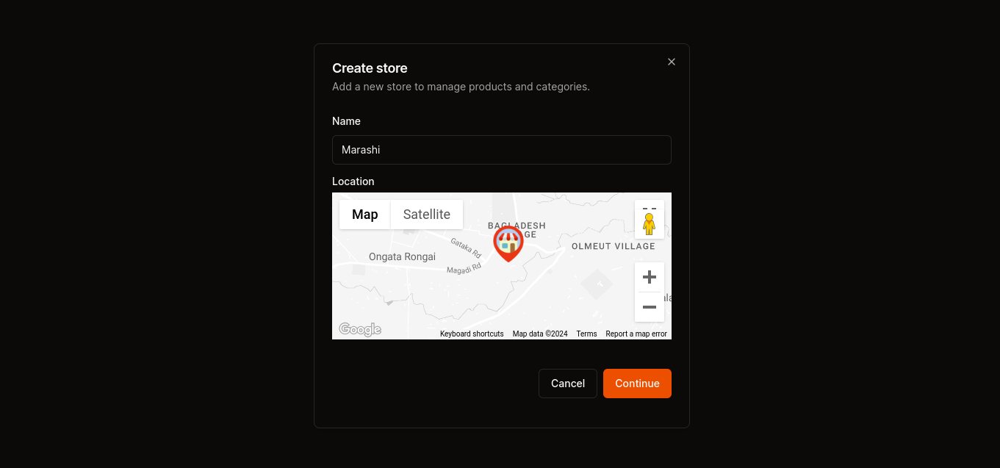

<a name="readme-top"></a>

<div align="center">

  
  <h1>Glamhub</h1>

<!-- Badges -->
<p>
  <a href="https://github.com/Louis3797/awesome-readme-template/graphs/contributors">
    
  </a>
  <a href="">
    
  </a>
  <a href="https://github.com/Louis3797/awesome-readme-template/network/members">
    
  </a>
  <a href="https://github.com/Louis3797/awesome-readme-template/stargazers">
    
  </a>
  <a href="https://github.com/Louis3797/awesome-readme-template/issues/">
    
  </a>
  <a href="https://github.com/Louis3797/awesome-readme-template/blob/master/LICENSE">
    
  </a>
</p>
   
<h4>
    <a href="https://store.glamhubproject.site">View Demo</a>
  <span> · </span>
    <a href="https://github.com/Louis3797/awesome-readme-template">Documentation</a>
  <span> · </span>
    <a href="https://github.com/Louis3797/awesome-readme-template/issues/">Report Bug</a>
  <span> · </span>
    <a href="https://github.com/Louis3797/awesome-readme-template/issues/">Request Feature</a>
  </h4>
</div>

<br />

> Outline a brief description of your project.

<!-- Table of Contents -->

# :notebook_with_decorative_cover: Table of Contents

- [:notebook_with_decorative_cover: Table of Contents](#notebook_with_decorative_cover-table-of-contents)
  - [:star2: About the Project](#star2-about-the-project)
    - [:space_invader: Tech Stack](#space_invader-tech-stack)
    - [:dart: Features](#dart-features)
    - [:art: Color Reference](#art-color-reference)
    - [:key: Environment Variables](#key-environment-variables)
  - [:toolbox: Getting Started](#toolbox-getting-started)
    - [:bangbang: Prerequisites](#bangbang-prerequisites)
    - [:gear: Installation](#gear-installation)
    - [:running: Run Locally](#running-run-locally)
  - [:eyes: Usage](#eyes-usage)
  - [:compass: Roadmap](#compass-roadmap)
  - [:wave: Contributing](#wave-contributing)
    - [:scroll: Code of Conduct](#scroll-code-of-conduct)
  - [:warning: License](#warning-license)
  - [:handshake: Contact](#handshake-contact)
  - [:gem: Acknowledgements](#gem-acknowledgements)

<!-- About the Project -->

## :star2: About the Project

<div align="center"> 
  
</div>
<div align="center"> 
  
</div>
<div align="center"> 
  
</div>
<div align="center"> 
  
</div>
<div align="center"> 
  
</div>
<div align="center"> 
  
</div>
<div align="center"> 
  
</div>
<div align="center"> 
  
</div>
<div align="center"> 
  
</div>

<!-- TechStack -->

### :space_invader: Tech Stack

<details>
<summary>Languages</summary>
     <a href="https://www.typescriptlang.org/">
     
    </a> <br/>
     <a href="https://www.rust-lang.org/">
     
    </a> <br/>
     <a href="https://www.python.org/">
     
    </a> <br/>
  
</details>

<details>
  <summary>Client</summary>
     <a href="https://nextjs.org/"></a> <br/>   
</details>

<details>
  <summary>Server</summary>
    <a href="https://nodejs.org/">
     
    </a> <br/>
</details>

<details>
<summary>Database</summary>
     <a href="https://postgresql.org/">
     
    </a> <br/> 
</details>

<details>
<summary>DevOps</summary>
    <a href="https://git-scm.com/">
     
    </a> <br/>
</details>

<details>
<summary>Cloud</summary>
    <a href="https://vercel.com/">
     
    </a> <br/>
 
</details>

<!-- Features -->

### :dart: Features

- Map Feature
- Shopping Feature
- Merchant Dashboard Feature

<!-- Color Reference -->

### :art: Color Reference

| Color           | Hex                                                              |
| --------------- | ---------------------------------------------------------------- |
| Primary Color   |  #222831 |
| Secondary Color |  #393E46 |
| Accent Color    |  #F07423 |
| Text Color      |  #EEEEEE |

<!-- Env Variables -->

### :key: Environment Variables

To run this project, you will need to add the following environment variables to your .env file

`NEXT_PUBLIC_API_URL`

`NEXT_PUBLIC_GOOGLE_API_KEY`

`GOOGLE_API_KEY`

`MPESA_API_KEY`

`MPESA_API_SECRET`

<!-- Getting Started -->

## :toolbox: Getting Started

<!-- Prerequisites -->

### :bangbang: Prerequisites

This project uses pnpm as package manager

```bash
 npm install --global pnpm
```

<!-- Installation -->

### :gear: Installation

Install ecommerce-store with pnpm

```bash
  pnpm i
  cd ecommerce-store
```

<!-- Run Locally -->

### :running: Run Locally

Clone the project

```bash
  git clone https://github.com/leqx/readme-template.git
```

Go to the project directory

```bash
  cd ecommerce-store
```

Install dependencies

```bash
  pnpm i
```

Start the server

```bash
  pnpm dev
```

<!-- Usage -->

## :eyes: Usage

Use this space to tell a little more about your project and how it can be used. Show additional screenshots, code samples, demos or link to other resources.

```javascript
import Component from 'my-project';

function App() {
  return <Component />;
}
```

<!-- Roadmap -->

## :compass: Roadmap

- [x] Add Changelog
- [x] Add back to top links
- [ ] Add Additional Templates w/ Examples
- [ ] Add "components" document to easily copy & paste sections of the readme
- [ ] Multi-language Support
  - [ ] Chinese
  - [ ] Spanish

<!-- Contributing -->

## :wave: Contributing

<a href="https://github.com/Louis3797/awesome-readme-template/graphs/contributors">
  
</a>

Contributions are what make the open source community such an amazing place to learn, inspire, and create. Any contributions you make are **greatly appreciated**.

If you have a suggestion that would make this better, please fork the repo and create a pull request. You can also simply open an issue with the tag "enhancement".
Don't forget to give the project a star! Thanks again!

1. Fork the Project
2. Create your Feature Branch (`git checkout -b feature/AmazingFeature`)
3. Commit your Changes (`git commit -m 'Add some AmazingFeature'`)
4. Push to the Branch (`git push origin feature/AmazingFeature`)
5. Open a Pull Request

<!-- Code of Conduct -->

### :scroll: Code of Conduct

Please read the [Code of Conduct](https://github.com/Louis3797/awesome-readme-template/blob/master/CODE_OF_CONDUCT.md)

<!-- License -->

## :warning: License

Distributed under the MIT License. See LICENSE.txt for more information.

<!-- Contact -->

## :handshake: Contact

Eugene Alex - [@twitter_handle](https://twitter.com/twitter_handle) - eugenealex123@gmail.com

Project Link: [https://store.glamhubproject.site](https://github.com/Louis3797/awesome-readme-template)

<a href="https://linkedin.com">
  
</a>
<a href="https://x.com">
 
</a>
<a href="https://eugenealex.me">
 
</a>
<a href="https:whatsapp.com/">
 
</a>

<!-- Acknowledgments -->

## :gem: Acknowledgements

Libraries used in this project.

- [Clerk.dev](https://shields.io/)
- [Nextjs](https://shields.io/)
- [Vercel](https://shields.io/)
